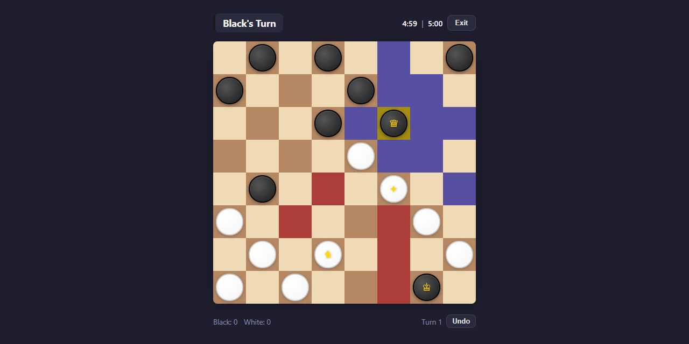
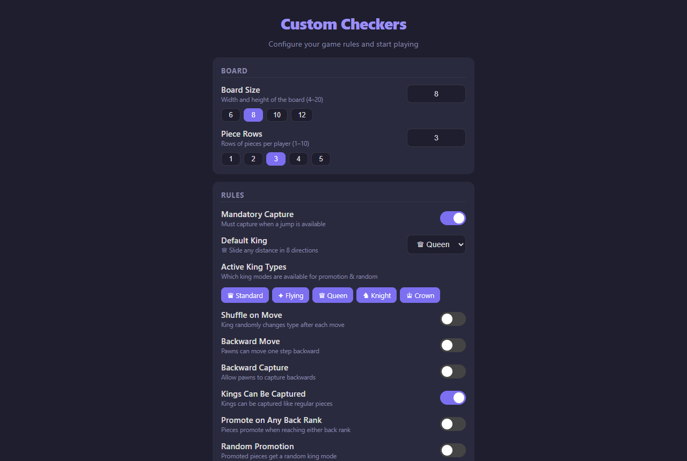
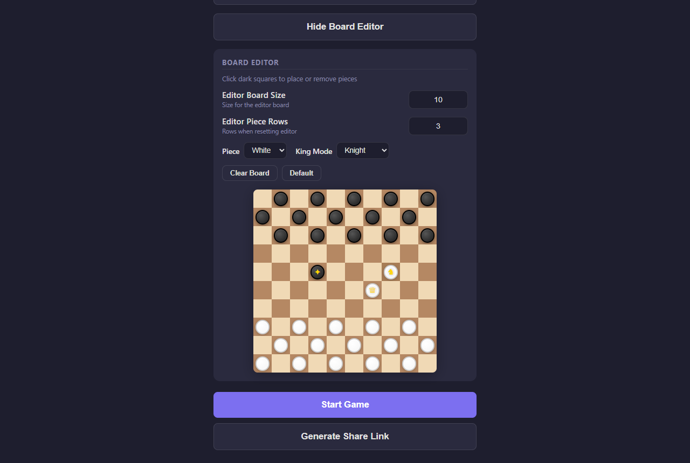

# Custom Checkers

**Checkers with the rules unlocked:** pick the board size, choose from 6 king movement modes, tune 20+ settings, design your own starting position, and play a friend online over a peer-to-peer connection. It's a static web app with no build step and no backend.
**▶ Play it online: [naniiic137.github.io/Custom-Checkers](https://naniiic137.github.io/Custom-Checkers/)**




| Rules panel | Board editor (10×10, custom kings) |
| --- | --- |
|  |  |

## Features

### 6 king movement modes

| Mode | Icon | Movement |
| --- | --- | --- |
| Standard | ♛ | One step diagonally (traditional checkers) |
| Flying | ✦ | Slides any distance diagonally, jumps over pieces |
| Queen | ♕ | Slides any distance in 8 directions |
| Knight | ♞ | L-shaped jumps like a chess knight |
| Crown | ♔ | One step in any direction + knight jumps |
| Random | ❓ | Picks a random active mode each move |

### Game rules
- **Board:** 4×4 to 20×20 via a number input (with 6 / 8 / 10 / 12 presets) and 1 to 10 piece rows per player
- **Active King Types:** chips that choose which modes are used for promotion and randomness
- **King variants:** Shuffle on Move (the king changes mode after each move), Random Promotion, Double Capture Kings (downgraded on the first capture, removed on the second), Kings Can Be Captured
- **Pawn variants:** Backward Move, Backward Capture, Promote on Any Back Rank
- **Win conditions:** Suicide Mode (the first player to lose all pieces wins), Stalemate Wins (a player with no moves wins instead of losing)
- **Draw Limit:** per-player move limits without a capture, with linked or independent inputs
- **Mandatory Capture** toggle: while any capture is available, only captures are offered, for every piece (a flying king with a jump available cannot slide instead). Selecting a piece that cannot capture outlines the pieces that must.
- Multi-jump chains and **Starting Player** (Black, White or Random)
- Game-over messages name the side they are about, e.g. "Black wins! White has no pieces left"
- **Per-player timer:** 30s, 1m, 2m, 5m or 10m

### Board editor
- Hidden behind a toggle, with its own board size and piece rows
- Click dark squares to place or remove pieces, choosing the colour (Black/White) and king mode (None/Standard/Flying/Queen/Knight/Crown/Random)
- **Clear Board** and **Default** buttons
- The edited board is used when the game starts and is included in share links

### Visuals
- 4 colour schemes: Classic, Green, Blue, High Contrast
- 3 piece styles: Classic, Modern, Flat
- A distinct icon for each king mode
- Optional highlighting of valid moves (the **Highlight Moves** setting, `hm=0` in a link turns it off): purple for moves, red for captures, plus markers for the selected piece and the last move
- Mobile-first responsive layout; on phones the space under the board shows both players, whose turn it is and the pieces each side has lost

### Undo
- Local games only: **Undo** takes back the last turn (a whole multi-jump chain) and gives it back to the player who made it. The first move can be undone too.
- The position is saved before every turn, so undo can be pressed repeatedly
- Hidden in online games

### Exit
- **Exit** during a game asks for confirmation first

## How multiplayer works

Multiplayer runs **peer-to-peer over WebRTC** using [PeerJS](https://peerjs.com/). The game has no server of its own.

1. The host clicks **Invite a player**. The app creates a random room ID, registers it as the host's PeerJS ID and copies the invite link (`?room=<id>`), which is also shown on screen. If the ID is already taken on the PeerJS server, it retries with a new one.
2. The guest opens the link and connects directly to the host's peer. The host's settings and board are sent over the connection.
3. The host presses **Start Game**. The host plays **Black** and the guest plays **White**; a "You: Black/White" badge and the player cards under the board say which side is yours, and each player sees the board from their own side (the host's view is turned around).
4. After every move, the game state (board, turn, captures, game-over status) is sent to the other player.
5. Both sides ping each other every 2 seconds. When a player closes the tab or goes silent, the other one is told. A guest who comes back with the same invite link picks the game up where it stopped.
6. **Play Again** keeps the same room, so the host can change settings between games.

**Copy rules/position link** is separate: it copies a link with every setting as short query parameters, plus the edited board (`bd`) when the editor is open. It opens a local game with those rules and never creates a room. Values in a link are validated: the board size is clamped to 4 to 20, and unknown starting players, king modes, timers or styles fall back to the defaults.

## Quick start

The app is plain HTML, CSS and JavaScript, so there is nothing to install or build. It has to be served over HTTP (not opened as `file://`):

```bash
git clone https://github.com/naniiic137/Custom-Checkers.git
cd Custom-Checkers
python -m http.server 8000      # or: npx http-server -p 8000
```

Then open <http://localhost:8000>.

### Play
- **Pass-and-play:** configure the rules and press **Start Game**. Both players take turns on the same device.
- **Online:** click **Invite a player**, send the copied link to a friend, and press **Start Game** once they have connected.
- **Custom position:** click **Show Board Editor**, set the size, place pieces and kings, then start the game or copy a rules/position link.

### Tests

The rules engine (`engine.js`) is a pure module with no DOM or PeerJS, loaded by the page as `window.CheckersEngine` and by Node for unit tests on move generation, forced capture, undo snapshots, win reasons and link validation (Node 18+, nothing to install):

```bash
node --test
```

### Deploy
Any static host works: GitHub Pages, Netlify, etc. There's no build command, and the publish directory is the repository root. Multiplayer needs HTTPS on a public host, which both of these provide.

## Project structure

```
Custom-Checkers/
├── index.html          # Settings panel, game panel, board editor, modals, multiplayer overlay
├── style.css           # Mobile-first styles, 4 colour schemes, 3 piece styles, king icons
├── engine.js           # Pure rules engine: move generation, forced capture, win checks, undo snapshots, link parsing
├── script.js           # UI: board rendering, editor, undo, timer, share/invite links, PeerJS sync and heartbeat
├── favicon.svg
├── tests/engine.test.js  # node:test unit tests for engine.js
└── docs/screenshots/   # README images
```

## Tech stack

- **HTML5 / CSS3** (custom properties, CSS Grid for the board)
- **Vanilla JavaScript** (ES6+, no framework, no bundler)
- **PeerJS 1.5.4** (WebRTC data channels) loaded from a CDN
- **URL query parameters** for shareable game configurations

## Author

Hamza Ben Ismail ([@naniiic137](https://github.com/naniiic137))
